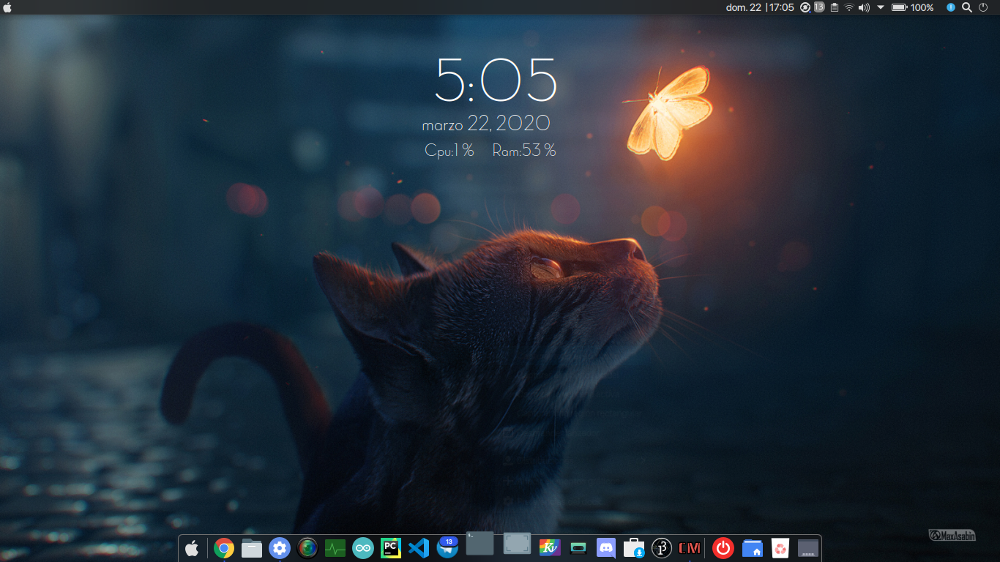
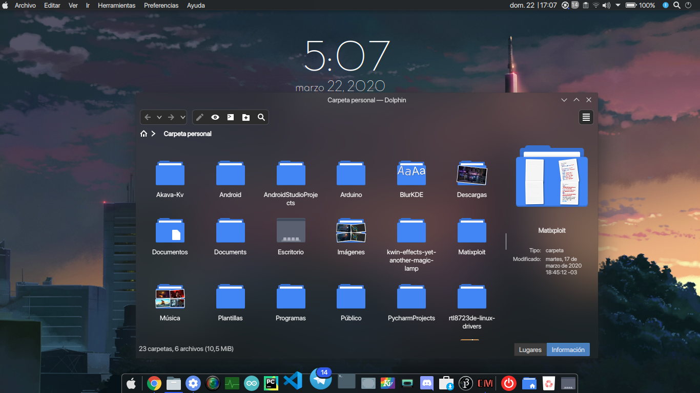
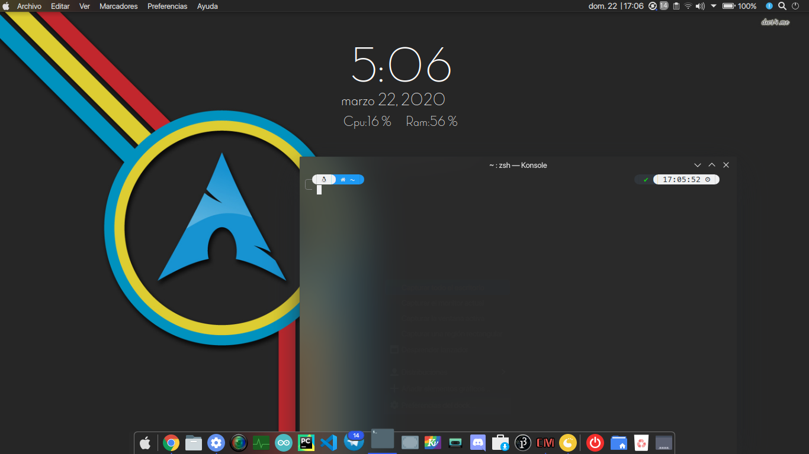
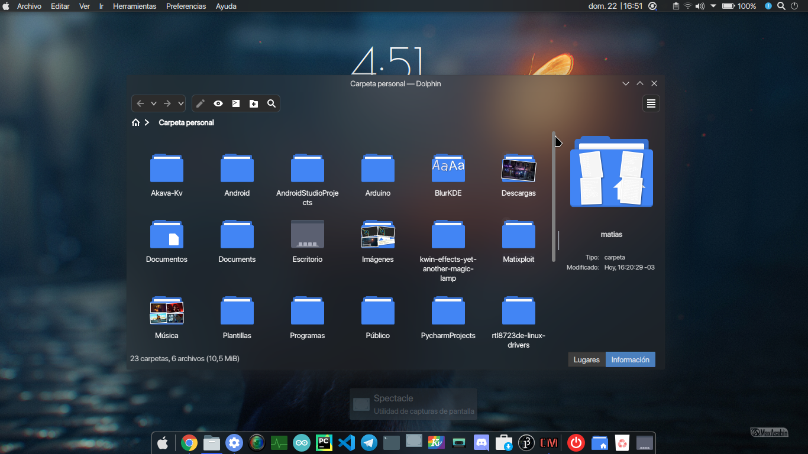

# BlurKDE (Solo descarga el script si sabes que estas usando Debian o Kwin)
Script to setup kde with blur, IG : @the_linux_boy ; Telegram : ShadowFighter99 ; Video tuto : https://www.youtube.com/watch?v=taSNrgn8_AY ; Seguí estas instrucciones, están más actualizadas que el video.

# Debian/Ubuntu:
sudo apt -y install git; git clone https://github.com/ShadowFighter99/BlurKDE.git ; cd BlurKDE ; sudo chmod +x install.sh; ./install.sh
# Fedora/Red hat based:
sudo dnf install git; git clone https://github.com/ShadowFighter99/BlurKDE.git ; cd BlurKDE ; sudo chmod +x install.sh; ./install.sh
# Arch/Manjaro : 
sudo pacman -S install git ;git clone https://github.com/ShadowFighter99/BlurKDE.git ; cd BlurKDE ; sudo chmod +x install.sh; ./install.sh
# Conky : 
https://drive.google.com/file/d/0B0eO_d_3xTouN0tyR0E5MXB0YTA/view

# Terminal
 sh -c "$(curl -fsSL https://raw.github.com/ohmyzsh/ohmyzsh/master/tools/install.sh)";
 
git clone --depth=1 https://github.com/romkatv/powerlevel10k.git $ZSH_CUSTOM/themes/powerlevel10k

sudo nano .zshrc

ZSH_THEME="powerlevel10k/powerlevel10k"
# #########################################################################################################################
# Plasma
Install inline battery , chili clock , minimal menu/plasma launchpad, global menu , active windows control, present windows button 
# Opacity:
45 in window decoration;
55 , 50 in Kvantum (Akava-Kv);
Fuerza Desenfoque : 12;
Fuerza Ruido : 2;
# Setup
Fonts : SFProdisplay(repo)

TerminalFont : Meslologs (repo)

icons: Qogir-dark || Vimix doder dark

TerminalTheme : Powerlevel10k

WindowDeco: BreezeBlur(Repo)

GlobalTheme : Pear Dark

LookandFeel : McMojave

Cursor : Pear Dark

SDDM : ittu

Colors : Akava(repo)

Kvantum : Akava-kv

Windows Effects: Yet another magic lamp : 150ms, shape quad.

Conky: Adele no rings : https://drive.google.com/file/d/0B0eO_d_3xTouN0tyR0E5MXB0YTA/view

# Notas
Las carpetas "Akava , en ~, pueden ser borradas", Los wallpapers estan en /images/Wallpapers, si , los podes robar sin descargar el script.
