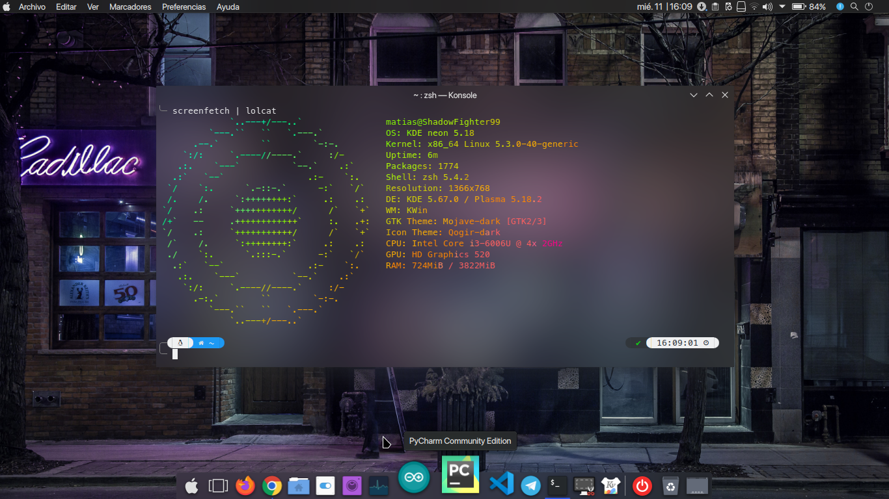
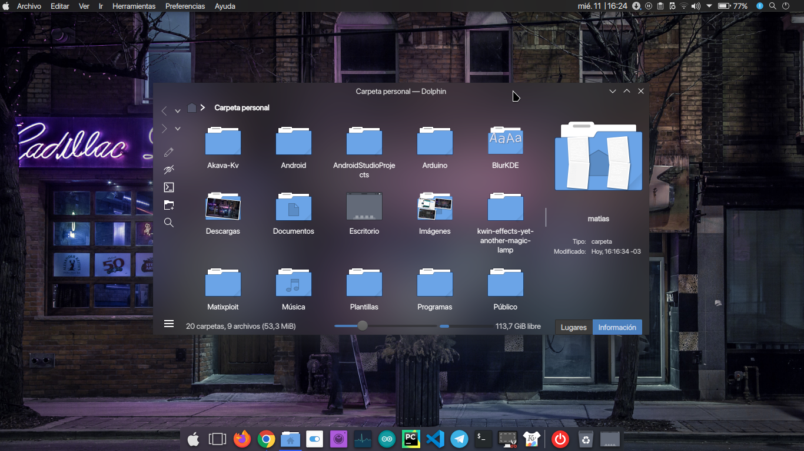

# BlurKDE
Script to setup kde with blur

# Debian:
sudo apt -y install git; git clone https://github.com/ShadowFighter99/BlurKDE.git ; cd BlurKDE ; sudo chmod +x install.sh; ./install.sh
# Fedora:
sudo dnf install git; git clone https://github.com/ShadowFighter99/BlurKDE.git ; cd BlurKDE ; sudo chmod +x install.sh; ./install.sh
# Arch : 
sudo pacman -S install git ;git clone https://github.com/ShadowFighter99/BlurKDE.git ; cd BlurKDE ; sudo chmod +x install.sh; ./install.sh
# Terminal
 sh -c "$(curl -fsSL https://raw.github.com/ohmyzsh/ohmyzsh/master/tools/install.sh)"
 git clone --depth=1 https://github.com/romkatv/powerlevel10k.git $ZSH_CUSTOM/themes/powerlevel10k
sudo nano .zshrc
ZSH_THEME="powerlevel10k/powerlevel10k"
# #########################################################################################################################
# Plasma
Install inline battery , chili clock , minimal menu/plasma launchpad, global menu , active windows control, present windows button 
# Opacity:
40 in window decoration;
60 , 50 in Kvantum (Akava-Kv);
Fuerza Desenfoque : 12;
Fuerza Ruido : 2;
